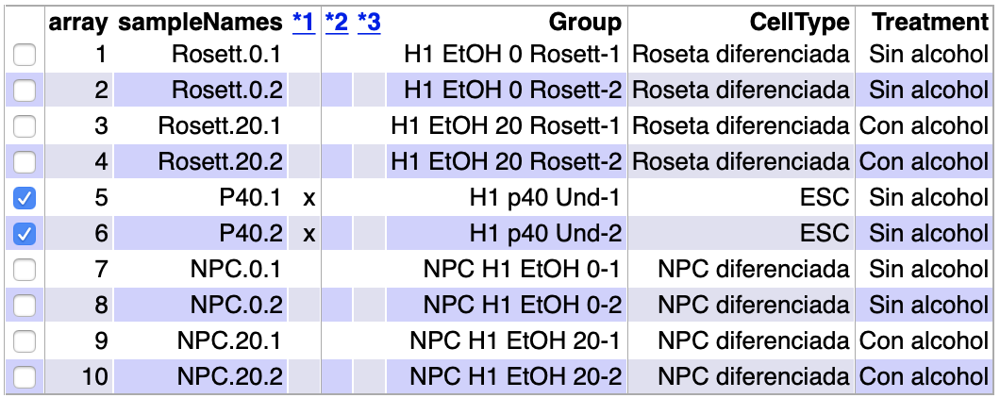

# Abstract

El estudio ha realizado un análisis de microarray de expresión génica estudiando la diferenciación de células precursoras neurales desde células madre embrionarias (ESC) en presencia o ausencia del tratamiento con etanol (EtOH). Los perfiles transcriptómicos de todo el genoma identificaron las alteraciones moleculares inducidas por la exposición al etanol durante la diferenciación neuronal de las ESC en rosetas neuronales y poblaciones de células precursoras neuronales. 

Los datos y el código del análisis se encuentran en el siguiente repositorio github [https://github.com/marinabf93/Effect-of-alcool-in-in-ESC-differentiation-]

# Objetivos

En este estudio se pueden diferenciar dos claros objetivos:

a) Demostrar los posibles efectos teratogénicos del alcohol en el desarrollo fetal y, por tanto, los consecuentes defectos de desarrollo debidos al abuso del alcohol durante la gestación.

b) Determinar los mecanismos específicos por los que el alcohol media estas lesiones, demostrando que el alcohol tiene un efecto significativo en los mecanismos reguladores moleculares y celulares de la diferenciación de las células madre embrionarias (ESC), incluidos los genes que intervienen en el desarrollo neuronal.

# Materiales

El método de este trabajo ha sido analizar bioinformáticamente los datos de un experimento con microarrays. El experimento en el que he basado mi análisis se recoge en en dos artículos:

a) "Molecular effect of ethanol during neural differentiation of human embryonic stem cells in vitro" [https://www.ncbi.nlm.nih.gov/pmc/articles/PMC4114725/]

b) "Alcohol-Induced Molecular Dysregulation in Human Embryonic Stem Cell-Derived Neural Precursor Cells" [https://www.ncbi.nlm.nih.gov/pmc/articles/PMC5040434/]

## Diseño experimental

El __tipo de experimento__ corresponde al análisis de microarrays, donde a través del diseño de un experimento se intenta responder a las cuestiones biológicas planteadas en los objetivos. Con el uso de la estadística y las diferentes herramientas bioinformáticas, se pretende procesar, analizar, visualizar y analizar los datos con el fin de responder a las cuestiones biológicas de partida.

En el estudio se investiga el efecto del alcohol (EtOH) en el desarrollo de células madre neurales derivadas desde células madre de embriones humanos. La metodología del experimento es la siguiente: 

Primero se cultivan células madre embrionarias (ESC) durante cinco días en un medio de inducción neural (NIM). A continuación, los agregados neuronales que se formaron fueron sembrados en placas recubiertas con poli-L-ornitina/laminina y cultivados con NIM durante siete días  para desarrollar la estructura de roseta neuronal. Al día siguiente de colocar los agregados neurales en dichas placas, se produjo el tratamiento con 20mM de EtOH. Las células fueron alimentadas con medio fresco todos los días alternando el tratamiento con 20 mM de etanol durante un día y dejando otro día de reposo sin tratamiento.
Después de siete días, las rosetas neurales fueron desalojadas y luego replateadas en medio NIM para la expansión de las células precursoras neurales (NPC) durante 5 días, siguiendo el mismo procedimiento para el tratamiento con 20mM de EtOH.

## Datos

El material en el que he basado mi análisis ha sido descargado desde la página del Gene Expression Omnibus (GEO). El GEO es un depósito de datos públicos de genómica funcional donde se aceptan datos basados en matrices y secuencias. Además, se proporcionan herramientas para ayudar a los usuarios a consultar y descargar experimentos y perfiles de expresión génica corregidos.

El conjunto de datos utilizados en este análisis se identifica con el número de adhesión: __GSE56906__:[https://www.ncbi.nlm.nih.gov/geo/query/acc.cgi?acc=GSE56906]. En este caso se han analizado 10 muestras distintas.

El __tipo de microarray__ utilizado ha sido del tipo Affymetrix Human Genome U133 Plus 2.0 Array, cuyo fabricante es _Affymetrix_ uno de los principales vendedores de tecnología de microarray.

## Software 

Para comenzar el análisis se necesita instalar __R statistical software__ el cual permite hacer análisis estadísticos, representaciones gráficas y lectura y creación de documentos en diferentes formatos. El software se puede descargar en la página web [https://cran.r-project.org/index.html] y solo deben seguirse las instrucciones indicadas en función del tipo de software del ordenador que se utilice para el análisis. 
El análisis de microarray que se presenta en este informe ha sido desarrollado con la versión 3.6.2 y todos los análisis se han llevado a cabo con la interfaz _RStudio_. Esta interfaz puede descargarse desde la página principal[https://www.rstudio.com/] 

# Métodos: Procedimiento general del análisis ("Workflow")

El flujo de trabajo se resumen en la imagen _Workflow_ dentro del directorio __figures__. Esta imagen ha sido obtenida de los materiales del curso dentro del siguiente repositorio github [https://github.com/ASPteaching/Omics_Data_Analysis-Case_Study_1-Microarrays].


A continuación resumiré de forma muy general los métodos utilizados en cada paso del flujo de trabajo, así como los datos de entrada y los de salida.
El desarrollo detallado de cada paso del análisis lo encontraréis en el archivo __Pipeline del análisis.Rmd__ dentro del directorio principal del repositorio indicado al inicio de este informe.

Antes de empezar con el análisis y a manejar la enorme cantidad de datos y ficheros que ello conlleva, crearé tres carpetas para la organización del mismo: 

  + La carpeta principal del análisis será "Effect of alcool in ESC differentiation", la cual también será mi directorio de trabajo.
  + Una carpeta llamada __data__ para almecenar todo tipo de datos del experimento y en los cuales basaré mi análisis. En esta carpeta guardaré los archivos _.CEL_ y el archivo _targets_, en el cual se decribirán los factores de estudio y sus niveles.
  + En la carpeta __results__ guardaré todos los resultados obtenidos en el análisis.
  + La carpeta __figures__ servirá para almacenar todo tipo de imágenes y figuras generadas durante el análisis.

## Identificación de los grupos y clasificación de las muestras

En este caso se han introducido los 10 archivos __.CEL__ correspondientes a las 10 muestras de partida del experimento. Estos archivos contienen los datos en crudo originados tras el escaneo y preprocesado de los microarrays.
Además, se ha leído el archivo __targets.csv__, el cual ha sido creado manualmente y en el que se incluye la información de los diferentes grupos y variables.

Tras la lectura conjunta de ambos archivos, se crea un objeto __rawData__ con el fin de resumir toda la información anterior. El resultado es la siguiente tabla:

```{r Readtargets, echo=FALSE}
targets <- read.csv2("./data/targets.csv", header = TRUE, sep = ";") 
knitr::kable(
  targets, booktabs = TRUE,
  caption = 'Content of the targets file used for the current analysis')
```
```{r ReadCELfiles, message=FALSE, results='hide', warning=FALSE, include=FALSE}
library(oligo)
celFiles <- list.celfiles("./data", full.names = TRUE)
library(Biobase)
#Asociación de los archivos CEL con el archivo targets
my.targets <-read.AnnotatedDataFrame(file.path("./data","targets.csv"), 
                                     header = TRUE, row.names = 1, 
                                     sep=";") 
rawData <- read.celfiles(celFiles, phenoData = my.targets)
print(pData(rawData))
```

## Control de calidad de los datos crudos

El objetivo de esta etapa es saber si los datos en crudo tienen la calidad suficiente como para ser normalizados. El control de calidad se lleva a cabo con el paquete __ArrayQualityMetrics__, este paquete efectúa distintos análisis con el fin de identificar los valores outliers a través de valores umbrales predefinidos.

Los datos de entrada son los datos en crudo _rawData_ y se devuelve un informe del control de calidad llamado _index.html_ guardado en el directorio __results__. En este informe se encontrarán boxplot de intensidad, análisis de componentes principales y MA plots entre otros. El criterio para eliminar un array del experimento es que este debe ser marcado tres veces como outlier. En la _Tabla 2_ se muestra el resumen del control de calidad de los datos crudos.

```{r QCRawDataRes, fig.cap="Tabla resumen del archivo index.html, generdo por el paquete arrayQualityMetrics en los datos crudos", echo=FALSE}
knitr::include_graphics("figures/QCRawData.png")
```

## Normalización

El objetivo de la normalización es hacer comparables los arrays entre sí además de eliminar cualquier variabilidad en las muestras no debida a razones biológicas. Es decir, la normalización de los datos asegura que las diferencias de intensidades en las muestras se deban a diferencias en la expresión de los genes y no a sesgos debidos a cuestiones técnicas del experimento.

El proceso consta de tres etapas: eliminación del ruido de fondo, normalización y sumarización de los datos. Los tres procesos se llevan a cabo gracias al método __Robust Multichip Analysis__ a través de la función _rma_.

Los datos de entrada son nuevamente los datos crudos _nuevame_rawData_ y como output se obtiene un ExpressionSet llamado __eset_rma__, que contiene los datos normalizados.

## Control de calidad de los datos normalizados

Se realiza el mismo procedimiento que para el control de calidad de los datos en crudo; sin embargo, esta vez los datos de entrada es el vector _eset_rma_ y como output se obtiene nuevamente una carpeta donde se encuentra informe del control de calidad _index.html_.

```{r QCNormDataRes, fig.cap="Tabla resumen del archivo index.html, generdo por el paquete arrayQualityMetrics en los datos normalizados", echo=FALSE}

```

Se puede comprobar en la _Figura 3_ como las intensidades de todas las muestras estan alineadas debido a que en el proceso de normaliación se incluye la normalización de los cuantiles, en el que la distribución empírica de todas las muestras se establece con los mismos valores.

```{r Normalization, include=FALSE}
eset_rma <- oligo::rma(rawData)
```
```{r BoxplotNormalized, message=FALSE, warning=FALSE, fig.cap="Boxplot para las intensidades de los arrays (Datos Normalizados)", echo=FALSE}
boxplot(eset_rma, cex.axis=0.5, las=2,  which="all", 
         col = c(rep("red", 2), rep("blue", 2), rep("green", 2), rep("yellow", 2), rep("pink",2)),
         main="Distribución de los valores de intensidad \n de los datos normalizados")
```

## Filtraje no específico

El filtraje no específico es el proceso de identificación y filtración de los genes que no se espera que se expresen diferencialmente porque varían muy poco entre las distintas condiciones; por lo que su variación podría deberse únicamente a la variación aleatoria. 
La función encargada de hacer esta tarea es _nsFilter_ del paquete __genefilter__. El criterio para identificar los genes que no se expresan diferencialmente de los que si lo hacen es un umbral dado por la persona encargada de hacer el análisis. Además, la función _nsFilter_ tiene una segunda función, la de eliminar las muestras que no tienen un identificador de genes asociado.

Antes de realizar el filtraje debemos conocer el tipo de microarray utilizado y, posteriormente, descargar la librería de anotaciones asociada a dicho tipo de microarray. En este análisis, el microarray utilizado corresponde con el modelo _Affymetrix Human Genome U133 Plus 2.0 Array_ y su librería de anotaciones es __hgu133plus2.db__.

En esta etapa el input son los datos normalizados y el output son los genes filtrados en un objeto llamado __eset_filtered__ cuya clase sigue siendo del tipo _ExpressionSet_.

## Identificación de genes diferencialmente expresados

Para identificar los genes diferencialmente expresados existen varios métodos. Hasta el momento, el método aue mejores resultados ofrece es el de __Modelos lineales para microarrays__. Dicho método está implementado en el paquete __limma__.

El rimer paso para el análisis basado en modelos lineales es crear la __matriz de diseño__, que es una tabla que describe la asignación de cada muestra a un grupo o condición experimental. Tiene tantas filas como muestras y tantas columnas como grupos, en este caso hay cinco grupos si juntamos los dos factores: tipo celular y tratamiento. Cada fila contiene un uno en la columna del grupo al que pertenece la muestra y un cero en las demás.

La matriz de diseño se elabora a partir de los datos filtrados _eset_filtered_ para devolvernos la siguiente matriz de diseño.

```{r LoadSavedData, echo=FALSE}
#Cargamos los datos filtrados
if (!exists("eset_filtered")) load (file="./results/normalized.Data.Rda")
```

```{r DesignMatrix, message=FALSE, echo=FALSE, error=FALSE, warning=FALSE}
#Descarga del paquete limma
library(limma)
designMat<- model.matrix(~0+Group, pData(eset_filtered))
colnames(designMat) <- c("Rosett.0", "Rosett.20", "p40", "NPC.0", "NPC.20")
print(designMat)
#Registro de la matriz de diseño
write.csv(designMat, file="./results/designMat.csv")
```

