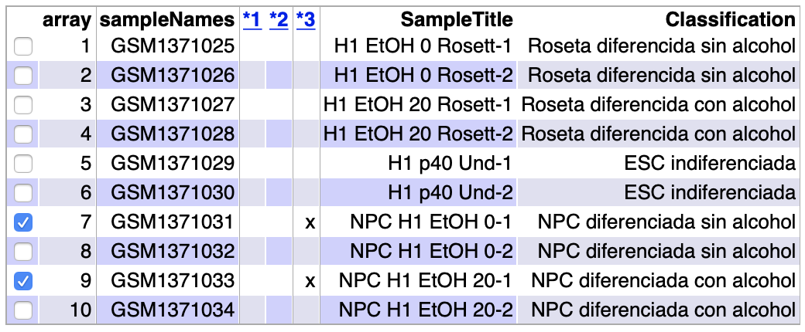
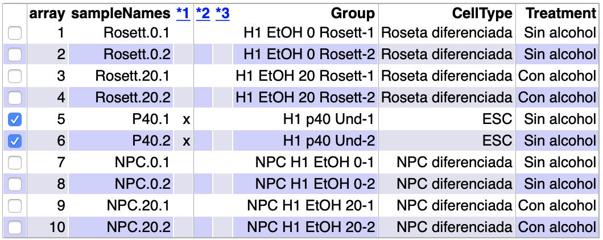

```{r setup, include=FALSE}
knitr::opts_chunk$set(echo = TRUE)
```

1. Datos del estudio

Los datos del análisis se han cargado desde la base de datos Gene Expression Omnibus (GEO). El conjunto de datos seleccionado se identifica con el número de adhesión: __GSE56906__.

El estudio que generó dichos datos investiga el efecto del alcohol (EtOH) en el desarrollo de células madre neurales derivadas desde células madre de embriones humanos. Existen indicios de que el alcohol interviene negativamente en el desarrollo de las células madre neurales. Para corroborar estos indicios, se han cultivado células madre embrionarias (ESC) durante cinco días en un medio de inducción neural (NIM). A continuación, los agregados neuronales que se formaron fueron sembrados en placas recubiertas con poli-L-ornitina/laminina y cultivados con NIM durante siete días  para desarrollar la estructura de roseta neuronal. Al día siguiente de colocar los agregados neurales en dichas placas, se produjo el tratamiento con 20mM de EtOH. Las células fueron alimentadas con medio fresco todos los días alternando el tratamiento con 20 mM de etanol durante un día y dejando otro día de reposo sin tratamiento.
Después de siete días, las rosetas neurales fueron desalojadas y luego replateadas en medio NIM para la expansión de las células precursoras neurales (NPC) durante 5 días siguiendo el mismo procedimiento para el tratamiento con 20mM de EtOH.

Los microarrays utilizados para este experimento fueron del siguiente tipo: Affymetrix Human Genome U133 Plus 2.0 Array.


##Preparación del ambiente de trabajo

Antes de empezar con el análisis y a manejar la enorme cantidad de datos y ficheros que ello conlleva, crearé tres carpetas para la organización del mismo: 

  + La carpeta principal del análisis será "Effect of alcool in ESC differentiation", la cual también será mi directorio de trabajo.
  + Una carpeta llamada __data__ para almecenar todo tipo de datos del experimento y en los cuales basaré mi análisis. En esta carpeta guardaré los archivos _.CEL_ y el archivo _targets_, en el cual se decribirán los factores de estudio y sus niveles.
  + En la carpeta __results__ guardaré todos los resultados obtenidos en el análisis.
  + La carpeta __figures__ servirá para almacenar todo tipo de imágenes y figuras generadas durante el análisis.
  
```{r CreateFolders, warning=FALSE, include=FALSE}
setwd(".")
dir.create("data")
dir.create("results")
dir.create("figures")
```

## Lectura de los datos

En el experimento se han analizado 10 muestras, las cuales se analizan en torno a dos factores: el tipo celular y el tipo de tratamiento durante la diferenciación celular.
Los niveles de dichos factores son los siguientes:

Para el factor __tipo celular__ existen tres niveles:

  + Células madre embrionarias (ESC) indiferenciadas _H1 p40_
  + Células neurales en forma de roseta _H1 Rosett_
  + Células progenitoras neurales (NPC) _NPC H1_
  
Para el factor __tipo de tratamiento__ existen dos niveles:

  + Células diferenciadas sin tratamiento con alcohol _EtOH 0_
  + Células diferenciadas bajo tratamiento con alcohol _EtOH 20_

Una tabla que recoge todas laas muestras sería la siguiente:

Referencia         | Tipo de muestra | Características
-------------------|-----------------|----------------
GSM1371025         |H1 EtOH0 Rosett1 |Roseta sin alcohol
GSM1371026         |H1 EtOH0 Rosett2 |Roseta sin alcohol
GSM1371027         |H1 EtOH20 Rosett1|Roseta con alcohol
GSM1371028         |H1 EtOH20 Rosett2|Roseta con alcohol
GSM1371029         |H1 p40 Und-1     |ESC indiferenciada
GSM1371030         |H1 p40 Und-2     |ESC indiferenciada
GSM1371031         |NPC H1 EtOH 0-1  |NPC sin alcohol
GSM1371032         |NPC H1 EtOH 0-2  |NPC sin alcohol
GSM1371033         |NPC H1 EtOH 20-1 |NPC con alcohol
GSM1371034         |NPC H1 EtOH 20-2 |NPC con alcohol

Para la lectura de los datos, primero he descargado los 10 archivos _.CEL_ desde la página de GEO y he creado un archivo llamado _targets.csv_ donde recopilo las características de cada muestra así como su referencia en la base de datos GEO. Tras haber instalado Bioconductor, procedo a la lectura del archivo targets y de los datos.

```{r installBioC, message=FALSE, warning=FALSE, eval=FALSE, include=FALSE}
if (!requireNamespace("BiocManager", quietly = TRUE))
    install.packages("BiocManager")
BiocManager::install()
```

```{r Readtargets, results='hide'}
targets <- read.csv2("./data/targets.csv", header = TRUE, sep = ";") 
knitr::kable(
  targets, booktabs = TRUE,
  caption = 'Content of the targets file used for the current analysis')
```

```{r ReadCELfiles, message=FALSE, results='hide', warning=FALSE}
library(oligo)
celFiles <- list.celfiles("./data", full.names = TRUE)
library(Biobase)
#Asociación de los archivos CEL con el archivo targets
my.targets <-read.AnnotatedDataFrame(file.path("./data","targets.csv"), 
                                     header = TRUE, row.names = 1, 
                                     sep=";") 
rawData <- read.celfiles(celFiles, phenoData = my.targets)
print(pData(rawData))
```

En las líneas de código anterior, he asociado la información alamcenada en los archivos _.CEL_ con la información del archivo _targets_ en la variable llamada __rawData__. 

La clase de archivo de la variable _rawData_ se llama __ExpressionSet__ y esta clase de archivos permite almacenar todo tipo de información del experimento.
A continuación, cambio el largo nombre de cada variable por un nombre más corto, almacenado en la columna _ShortName_ del archivo "targets".

```{r ChangeName, results='hide'}
my.targets@data$ShortName->rownames(pData(rawData))
colnames(rawData) <-rownames(pData(rawData)) 

head(rawData)
```

2. Contro de calidad de los datos crudos

El control de calidad de los datos en crudo nos permite conocer la calidad de los datos recogidos durante el experimento a través de un boxplot de intensidad o un estudio de los componentes principales (PCA). Este paso es muy importante ya que es donde se evalua si los datos tienen suficiente calidad para la normalización de los mismos. Si alguno de los array no tiene la calidad suficiente, este será marcado y expuesto a revisión para decidir si mantenemos o no dicho array en el análisis.

El paquete que desarrolla el control de calidad se llama __ArrayQualityMetrics__ y todos los resultados se recogen en el archivo __index.html__ dentro de la carpeta _rawData_quality_ del directorio _results_.

```{r QCRaw, message=FALSE, warning=FALSE, eval=FALSE}
library(arrayQualityMetrics)
#Guardar los resultados del control calidad en el directorio results
arrayQualityMetrics(rawData, outdir = "./results/rawData_quality", force = TRUE)
```

La siguiente tabla resumen nos ofrece el resultado del control de calidad.

```{r QCRawDataRes, fig.cap="Tabla resumen del archivo index.html, generdo por el paquete arrayQualityMetrics en los datos crudos", echo=FALSE}

```

Los arrays 7 y 9 se consideran outliers a través de un plot MA, el cual visualiza las diferencias entre las mediciones tomadas en dos muestras. Sin embargo, ambos arrays los mantendré en el análisis puesto que solo una de las tres pruebas no es suficiente para considerar suprimir dichos arrays del análisis.

A continuación desarrollo el gráfico resultado del __Análisis de Componentes Principales (PCA)__, donde se recogen los dos primeros componentes principales.Dicho gráfico se recoge en el directorio _figures_.

```{r Function plot PCA, include=FALSE}
library(ggplot2)
library(ggrepel)
plotPCA3 <- function (datos, labels, factor, title, scale,colores, size = 1.5, glineas = 0.25) {
  data <- prcomp(t(datos),scale=scale)
  # plot adjustments
  dataDf <- data.frame(data$x)
  Group <- factor
  loads <- round(data$sdev^2/sum(data$sdev^2)*100,1)
  # main plot
  p1 <- ggplot(dataDf,aes(x=PC1, y=PC2)) +
    theme_classic() +
    geom_hline(yintercept = 0, color = "gray70") +
    geom_vline(xintercept = 0, color = "gray70") +
    geom_point(aes(color = Group), alpha = 0.55, size = 3) +
    coord_cartesian(xlim = c(min(data$x[,1])-5,max(data$x[,1])+5)) +
    scale_fill_discrete(name = "Group")
  # avoiding labels superposition
  p1 + geom_text_repel(aes(y = PC2 + 0.25, label = labels),segment.size = 0.25, size = size) + 
    labs(x = c(paste("PC1",loads[1],"%")),y=c(paste("PC2",loads[2],"%"))) +  
    ggtitle(paste("Análisis de componentes principales para: ",title,sep=" "))+ 
    theme(plot.title = element_text(hjust = 0.5)) +
    scale_color_manual(values=colores)
  }
```


```{r PCARaw, message=FALSE, fig.cap="Visualization of the two first Principal Components for raw data"}
require(ggplot2)
plotPCA3(exprs(rawData), labels = targets$ShortName, factor = targets$Group, 
         title="Datos crudos", scale = FALSE, size = 4, 
         colores = c("red", "blue", "green", "yellow", "pink"))
```
```{r savePCAraw, echo=TRUE, results='hide', include=FALSE}
tiff("figures/PCA_RawData.tiff", res = 200, width = 4.5, height = 4, units = 'in')
plotPCA3(exprs(rawData), labels = targets$ShortName, factor = targets$Group, 
         title="Datos crudos", scale = FALSE, size = 4, 
         colores = c("red", "blue", "green", "yellow", "pink"))
dev.off()
```

El análisis de componentes principales indica que el 57,4% de la variabilidad total de las muestras se explica con el primer componente. En el gráfico se observa cómo el factor _tipo celular_ es la principal fuente de variabilidad, puesto que las células indiferenciadas (p40) se encuentran a la derecha del gráfico mientras que las células diferenciadas (NPC) se sitúan a la izquierda del mismo. Del mismo modo, el tipo celular _Rosetta_ se encuentra en mitad del gráfico ya que es el grupo intermedio entre las células madre embrionarias (p40) y las células progenitoras neurales (NPC).

Existen otros gráficos que nos deja el control de calidad de los datos en crudo, entre ellos destaca el boxplot múltiple con la distribución de las intensidades a lo largo de todas las muestras.

```{r BoxplotRaw, message=FALSE, fig.cap="Boxplot para las intensidades de los arrays (Raw Data)", echo=FALSE}
boxplot(rawData, cex.axis=0.5, las=2,  which="all", 
         col = c(rep("red", 2), rep("blue", 2), rep("green", 2), rep("yellow", 2), rep("pink",2)),
         main="Distribution of raw intensity values")
```
```{r saveIntensRaw, echo=FALSE, results='hide'}
#Guardo el boxplot múltiple en un archivo tiff en el directorio figures
tiff("./figures/Intensity_RawData.tiff", res = 200, width = 4, height = 4, units = 'in')
boxplot(rawData, cex.axis=0.5, las=2,  which="all", 
         col = c(rep("red", 2), rep("blue", 2), rep("green", 2), rep("yellow", 2), rep("pink",2)),
         main="Distribución de los valores de \n intensidad de los datos crudos")
dev.off()
```

3. Normalización de los datos crudos

El objetivo de la normalización es hacer comparables los arrays entre sí además de eliminar cualquier variabilidad en las muestras no debida a razones biológicas. Es decir, la normalización de los datos asegura que las diferencias de intensidades en las muestras se deban a diferencias en la expresión de los genes y no a sesgos debidos a cuestiones técnicas del experimento.

El proceso consta de tres etapas: eliminación del ruido de fondo, normalización y sumarización de los datos. Los tres procesos se llevan a cabo gracias al método __Robust Multichip Analysis__ a través de la función _rma_.

```{r Normalization}
eset_rma <- oligo::rma(rawData)
```

Una vez tenemos los datos normalizados, repetimos el proceso de control de calidad de los datos pero con los datos normalizados.

4. Control de calidad de los datos normalizados

```{r QCNorm, message=FALSE, warning=FALSE, eval=FALSE, include=FALSE}
arrayQualityMetrics(eset_rma, outdir = file.path("./results", "normalized_quality"), force=TRUE)
```

El resultado del control de calidad de los datos normalizados los podemos ver nuevamente en el archivo __index.html__ de la carpeta _normalized_quality_ en el directorio _results_. 
El resumen del resultado se muestra en la siguiente tabla, donde se observan los arrays 5 y 6 como outliers a través de la medida "distancias entre arrays". Estos arrays se mantendrán en el análisis por la misma justificación dada anteriormente, una sola prueba de las tres pruebas realizadas para detectar outliers no es suficiente como para eliminar un array del análisis.

```{r QCNormDataRes, fig.cap="Tabla resumen del archivo index.html, generdo por el paquete arrayQualityMetrics en los datos normalizados", echo=FALSE}

```

Se puede observar en el gráfico de __Componentes Principales__ de los datos normalizados que las muestras se siguen separando en función al _tipo celular_, indicando que este sigue siendo el factor principal de variación entre las muestras y no el tratamiento con alcohol. En este caso, dicho factor explica el 69,5% de la variabilidad total de las muestras.

```{r PCANorm, message=FALSE, fig.cap="Visualization of first two principal components for normalized data"}
plotPCA3(exprs(eset_rma), labels = targets$ShortName, factor = targets$Group, 
         title="Datos normalizados", scale = FALSE, size = 4, 
         colores = c("red", "blue", "green", "yellow", "pink"))
```
```{r savePCANormalized, echo=FALSE, results='hide'}
#Guardo el plot PCA en un archivo tiff en el directorio figures
tiff("figures/PCA_NormalizedData.tiff", res = 200, width = 4, height = 4, units = 'in')
plotPCA3(exprs(eset_rma), labels = targets$ShortName, factor = targets$Group, 
         title="Datos normalizados", scale = FALSE, size = 4, 
         colores = c("red", "blue", "green", "yellow", "pink"))
dev.off()
```

En el boxplot de intensidades de los datos normalizados se espera que todos los boxplots tengan el mismo aspecto; es decir, las mismas intensidades. Esto es debido a que en el proceso de normaliación se incluye la normalización de los cuantiles, en el que la distribución empírica de todas las muestras se establece con los mismos valores. Aquí se muestra el boxplot de __Distribución de los valores de intensidad de los datos normalizados__.

```{r BoxplotNormalized, message=FALSE, warning=FALSE, fig.cap="Boxplot para las intensidades de los arrays (Datos Normalizados)"}
boxplot(eset_rma, cex.axis=0.5, las=2,  which="all", 
         col = c(rep("red", 2), rep("blue", 2), rep("green", 2), rep("yellow", 2), rep("pink",2)),
         main="Distribución de los valores de intensidad \n de los datos normalizados")
```
```{r saveIntensNormalized, echo=FALSE, results='hide', warning=FALSE}
#Guardo el boxplot múltiple en un archivo tiff en el directorio figures
tiff("figures/Intensity_NormalizedData.tiff", res = 200, width = 4, height = 4, units = 'in')
boxplot(eset_rma, cex.axis=0.5, las=2,  which="all", 
         col = c(rep("red", 2), rep("blue", 2), rep("green", 2), rep("yellow", 2), rep("pink",2)),
         main="Distribución de los valores de \n intensidad de los datos normalizados")
dev.off()
```

Un control que acompaña al análisis de componentes principales, es el llamado __Batch Detection__. Este control consiste en conocer la procedencia de la mayor fuente de variabilidad introducido por las variaciones experimentales dependientes del tiempo y lugar del experimento a la hora de recolectar y analizar las muestras.

Existen distintos métodos de llevar a cabo este control, uno de los más conocidos es el llamado __Combat and Principal variation component analysis (PVCA)__. Esta técnica estima la fuente y la proporción de la variación en dos pasos, el análisis de componentes principales y el análisis de componentes de variación.

```{r BatchDetection, message=FALSE, warning=FALSE, include=FALSE}
#Cargamos la librería
library(pvca)
pData(eset_rma) <- targets
#Selecciono el punto de corte o umbral
pct_threshold <- 0.6
#Selecciono las variables a analizar
batch.factors <- c("Group", "Treatment")
#Corro en análisis
pvcaObj <- pvcaBatchAssess (eset_rma, batch.factors, pct_threshold)
```

En el gráfico de estimación de PVCA se muestra una barra por cada fuente de variación incluída en el análisis. El gráfico indica que el factor _Group_ es el de mayor variabilidad, al cual se le atribuye aproximadamente el 79% de la variación; esto coincide con lo observado en los gráficos de componentes principales tanto de los datos en crudo como de los datos normalizados. Además, se indica que el factor _Tratamiento con EtOH_ tan sólo supone un 2,7% de la variabilidad de las muestras.

```{r plotPVCA, fig.cap="Importancia relativa de los dos factores: tipo celular y tratamiento con EtOH que afectan a la expresión de los genes", echo=FALSE}
#plot the results
bp <- barplot(pvcaObj$dat, xlab = "Factores",
  ylab = "Variación de la proporción media ponderada",
  ylim= c(0,1.1),col = c("turquoise"), las=2,
  main="Estimación PVCA")
axis(1, at = bp, labels = pvcaObj$label, cex.axis = 0.55, las=2)
values = pvcaObj$dat
new_values = round(values , 3)
text(bp,pvcaObj$dat,labels = new_values, pos=3, cex = 0.5)
```
```{r savePVCAplot, echo=FALSE, results='hide'}
#Almaceno el plot en un archivo tiff
tiff("figures/PVCAplot.tiff", res = 150, width = 5, height = 5, units = 'in')
bp <- barplot(pvcaObj$dat, xlab = "Factores",
  ylab = "Variación de la proporción media ponderada",
  ylim= c(0,1.1),col = c("turquoise"), las=2,
  main="Estimación PVCA")
axis(1, at = bp, labels = pvcaObj$label, cex.axis = 0.55, las=2)
values = pvcaObj$dat
new_values = round(values , 3)
text(bp,pvcaObj$dat,labels = new_values, pos=3, cex = 0.5)
dev.off()
```

5. Filtraje no específico

El filtraje no específico es el proceso de identificación y filtración de los genes que no se espera que se expresen diferencialmente, sino que su variación pueda deberse a la variación aleatoria.

La función encargada de hacer esta tarea es _nsFilter_ del paquete __genefilter__. El criterio para identificar los genes que no se expresan diferencialmente de los que si lo hacen es un umbral dado por la persona encargada de hacer el análisis. Además, la función _nsFilter_ tiene una segunda función, la de eliminar las muestras que no tienen un identificador de genes asociado.

Antes de realizar el filtraje debemos conocer el tipo de microarray utilizado y, posteriormente, descargar la librería de anotaciones asociada a dicho tipo de microarray. En este análisis, el microarray utilizado corresponde con el modelo _Affymetrix Human Genome U133 Plus 2.0 Array_.

```{r Filtering1, results='hide', message=FALSE}
#Descarga del paquete genefilter para la función nsfilter
library(genefilter)
#Descarga de la libreria de anotaciones del microarray utilizado
library(hgu133plus2.db)
annotation(eset_rma) <- "hgu133plus2.db"
filtered <- nsFilter(eset_rma, 
                     require.entrez = TRUE, remove.dupEntrez = TRUE,
                     var.filter=TRUE, var.func=IQR, var.cutoff=0.75, 
                     filterByQuantile=TRUE, feature.exclude = "^AFFX")
```

El filtraje nos devuelve los genes filtrados en un objeto llamado en este caso __eset_filtered__. La clase de este objeto sigue siendo _ExpressionSet_; ya que este objeto se ha obtenido a través de los datos normalizados _eset_rma_, que a su vez se obtuvieron de los datos en bruto _rawData_, todos de la misma clase.

```{r FilterResults1, results='hide', echo=FALSE, include=FALSE}
names(filtered)
class(filtered$eset)
```

```{r FilterResults2, include=FALSE}
print(filtered$filter.log)
eset_filtered <-filtered$eset
```

6. Identificación de genes diferencialmente expresados

Para identificar los genes diferencialmente expresados existen varios métodos. Hasta el momento, el método aue mejores resultados ofrece es el de __Modelos lineales para microarrays__. Dicho método está implementado en el paquete __limma__.

El __primer paso__ para el análisis basado en modelos lineales es crear la _matriz de diseño_, que es una tabla que describe la asignación de cada muestra a un grupo o condición experimental. Tiene tantas filas como muestras y tantas columnas como grupos, en este caso hay cinco grupos si juntamos los dos factores: tipo celular y tratamiento. Cada fila contiene un uno en la columna del grupo al que pertenece la muestra y un cero en las demás.

La matriz de diseño se elabora a partir de los datos filtrados _eset_filtered_. El resultado es el siguiente:

```{r LoadSavedData, echo=FALSE}
#Cargamos los datos filtrados
if (!exists("eset_filtered")) load (file="./results/normalized.Data.Rda")
```

```{r DesignMatrix, message=FALSE, echo=FALSE}
#Descarga del paquete limma
library(limma)
designMat<- model.matrix(~0+Group, pData(eset_filtered))
colnames(designMat) <- c("Rosett.0", "Rosett.20", "p40", "NPC.0", "NPC.20")
print(designMat)
#Registro de la matriz de diseño
write.csv(designMat, file="./results/designMat.csv")
```

Una vez hecha la matriz de diseño, el __segundo paso__ es realizar comparaciones entre los grupos de genes a través de la _matriz de contraste_. La matriz de contraste tendrá tantas columnas como comparaciones se hagan y tantas filas como grupos existentes. Esta matriz estará compuesta de 1 y -1 en las filas de grupos a comparar y ceros en el resto.

Según el [artículo del experimento](https://www.ncbi.nlm.nih.gov/pmc/articles/PMC5040434/),la correlación de la expresión génica con el tratamiento con EtOH no fue lo suficientemente fuerte sobre el efecto de la diferenciación. Por lo tanto, se decide analizar el conjunto de datos para el efecto del EtOH en las células de la roseta y NPC por separado. 

La matriz de contraste la he definido para realizar cuatro comparaciones, dos comparaciones para cada tipo celular (Roseta y NPC), con el fin de responder a las siguientes preguntas:

__Contrastes para las rosetas neurales:__

  + Efecto de la diferenciación celular hacia rosetas neurales
  + Efecto del tratamineto con EtOH en rosetas neurales

__Contrastes para las células progenitoras neurales (NPC):__

  + Efecto de la diferenciación celular hacia células progenitoras neurales
  + Efecto del tratamineto con EtOH en células progenitoras neurales
  
```{r setContrasts, echo=FALSE}
cont.matrix <- makeContrasts (p40vsRosett0 = p40-Rosett.0,
                              Rosett20vsRosett0 = Rosett.20-Rosett.0,
                              p40vsNPC0 = p40-NPC.0,
                              NPC20vsNPC0 = NPC.20-NPC.0,
                              levels=designMat)
print(cont.matrix)
#Registro de la matriz de contrastes
write.csv(cont.matrix, file="./results/cont.matrix.csv")
```

Ahora que las matrices de diseño y contraste están creadas, puedo pasar a estimar el modelo y hacer las pruebas de significación para decidir qué genes se expresan diferencialmente en cada condición.

El método del paquete _limma_ para la selección de genes utiliza modelos empíricos de Bayes para combinar una estimación de la variabilidad basada en toda la matriz con estimaciones individuales basadas en cada uno de los valores individuales. Los estadísticos de prueba se utilizan para ordenar los genes de más a menos expresados.

Este método, además, controla el número de falsos positivos a través de un ajsute de los p-valores por el método de _Benjamini and Hochberg_.

Finalmente, la información relevante para la posterior exploración de los resultados se almacena en un objeto R de la clase __MArrayLM__ definido en el paquete _limma_. El objeto se llamará __fit.main__.

```{r, linearmodelfit, echo=FALSE, include=FALSE}
library(limma)
fit<-lmFit(eset_filtered, designMat)
fit.main<-contrasts.fit(fit, cont.matrix)
fit.main<-eBayes(fit.main)
class(fit.main)
```

Para terminar con la identificación de los genes diferencialmente expresados, debo obtener la lista de dichos genes. Esto se hace a través de la función __topTable__ del paquete _limma_. La función _topTable_ nos devolverá una lista de genes ordenados de menor a mayor p-valor, lo que se traduce en genes de más a menos expresados diferencialmente.
Junto al estadístico p-valor aparecen otros estadísticos, destacando el p-valor ajustado o el estadístico B, que es el posterior logaritmo de probabilidades del gen de ser contra no ser expresado diferencialmente.

Obtendré una tabla para cada uno de los cuatro contrastes llevados a cabo.

__Comparación 1__ (p40vsRosett0): Genes que cambian su expresión entre células indiferenciadas y rosetas neurales.

```{r, topTabs1, echo=FALSE}
topTab_p40vsRosett0 <- topTable (fit.main, number=nrow(fit.main), coef="p40vsRosett0", adjust="fdr") 
head(topTab_p40vsRosett0)
```

__Comparación 2__ (Rosett20vsRosett0): Genes que cambian su expresión bajo el tratamiento con 20mM de EtOH en rosetas neurales.

```{r, topTabs2, echo=FALSE}
topTab_Rosett20vsRosett0 <- topTable (fit.main, number=nrow(fit.main), coef="Rosett20vsRosett0", adjust="fdr") 
head(topTab_Rosett20vsRosett0)
```

__Comparación 3__ (p40vsNPC0): Genes que cambian su expresión entre células indiferenciadas y células progenitoras neurales.

```{r, topTabs3, echo=FALSE}
topTab_p40vsNPC0 <- topTable (fit.main, number=nrow(fit.main), coef="p40vsNPC0", adjust="fdr") 
head(topTab_p40vsNPC0)
```

__Comparación 4__ (NPC20vsNPC0): Genes que cambian su expresión bajo el tratamiento con 20mM de EtOH en células progenitoras neurales.

```{r, topTabs4, echo=FALSE}
topTab_NPC20vsNPC0 <- topTable (fit.main, number=nrow(fit.main), coef="NPC20vsNPC0", adjust="fdr") 
head(topTab_NPC20vsNPC0)
```

La primera columna de cada una de las tablas obtenidas contiene la identificación del fabricante (Affymetrix) de cada conjunto de sondas; mientras que el resto de columnas son variables numéricas y estadísticas para indicar el cambio de pliegue del gen. Con estas tablas finalizaría el proceso de identificación de los genes diferencialmente expresados.

6. Anotación de los resultados

El proceso de anotación consiste en relacionar los identificadores de la primera columna de las tablas, los cuales corresponden a conjuntos de sondas o tránscritos, con información más fácil de manejar como el _Gene Symbol_, _Entrez Gene_ o _Gene description_. Es decir, el proceso de anotación es la identificación de cada gen con cada ID de Affymetrix, además de complementar dichos genes con la máxima información posible encontrada en diferentes bases de datos.

Para realizar la anotación de los resultados, sigo una función de base cuyas funciones serán:

-Identificar a la primera columna de las tablas obtenidas anteriormente como _PROBEID_, esta columna contiene las identificaciones de las sondas de Affymetrix.
-Asociar a cada sonda de Affymetrix los identificadores _SYMBOL_, _ENTREZID_ y _GENENAME_ disponibles en el archivo de anotaciones del microarray utilizado.

El paquete de anotaciones para el microarray utilizado es __hgu133plus2.db__. Una vez que creemos las nuevas tablas, derivadas de las tablas obtenidas con _topTab_ y a las que se les han añadido las anotaciones pertinentes, se guardarán en diferentes archivos _.csv_ dentro del directorio __resultados__.

```{r GeneAnnotation, message=FALSE, warning=FALSE}
annotatedTopTable <- function(topTab, anotPackage)
{
  topTab <- cbind(PROBEID=rownames(topTab), topTab)
  myProbes <- rownames(topTab)
  thePackage <- eval(parse(text = anotPackage))
  geneAnots <- select(thePackage, myProbes, c("SYMBOL", "ENTREZID", "GENENAME"))
  annotatedTopTab<- merge(x=geneAnots, y=topTab, by.x="PROBEID", by.y="PROBEID")
return(annotatedTopTab)
}
```

```{r annotateTopTables, results='hide', message=FALSE, include=FALSE}
require(hgu133plus2.db)
topAnnotated_p40vsRosett0 <- annotatedTopTable(topTab_p40vsRosett0,
anotPackage="hgu133plus2.db")
topAnnotated_Rosett20vsRosett0 <- annotatedTopTable(topTab_Rosett20vsRosett0,
anotPackage="hgu133plus2.db")
topAnnotated_p40vsNPC0 <- annotatedTopTable(topTab_p40vsNPC0,
anotPackage="hgu133plus2.db")
topAnnotated_NPC20vsNPC0 <- annotatedTopTable(topTab_NPC20vsNPC0,
anotPackage="hgu133plus2.db")
write.csv(topAnnotated_p40vsRosett0, file="./results/topAnnotated_p40vsRosett0.csv")
write.csv(topAnnotated_Rosett20vsRosett0, file="./results/topAnnotated_Rosett20vsRosett0.csv")
write.csv(topAnnotated_p40vsNPC0, file="./results/topAnnotated_p40vsNPC0.csv")
write.csv(topAnnotated_NPC20vsNPC0, file="./results/topAnnotated_NPC20vsNPC0.csv")
```

Los resultados de las tablas de selección se pueden visualizar a través de un gráfico llamado __volcano plot__. En este gráfico se representa en el eje de abscisas los cambios de expresión en escala logarítmica; mientras que en el eje de ordenadas se representa el estadístico B o probabilidad del gen de estar contra la probabilidad de no estar expresado diferencialmente (en escala logarítmica). En este caso se representan los cuatro primeros genes más diferencialmente expresados de cada tabla.

Los resultados se recogen en el archivo _Volvanos.pdf_ del directorio __figures__.

```{r volcanoPlot, selection of the four first genes on the topTab, warning=FALSE, message=FALSE, error=FALSE}
library(hgu133plus2.db)
geneSymbols <- select(hgu133plus2.db, rownames(fit.main), c("SYMBOL"))
SYMBOLS<- geneSymbols$SYMBOL
```

```{r saveVolcanos, echo=FALSE, results='hide'}
pdf("figures/Volcanos.pdf")
for (i in colnames(cont.matrix)){
  volcanoplot(fit.main, coef=i, highlight=4, names=SYMBOLS, col="red",
              main=paste("Genes diferencialmente expresados",i, sep="\n"))
  abline(v=c(-1,1))
}
dev.off()
```

8. Comparación entre distintas comparaciones

En este análisis se han realizado cuatro contrastes, dos contrastes para las rosetas neurales y dos para las células progenitoras neurales. El objetivo es extraer los genes que cambian simultáneamente entre las distintas comparaciones para cada tipo celular por separado.

Para anotar y contar los genes que cambian en una o más condiciones se utiliza la función __decideTest__ del paquete _limma_. Esta función nos devolverá una tabla llamada __res__ cuya interpretación es la siguiente:

  + 1: El gen esta sobreexpresado (Up)
  + 0: No hay cambio significativo en la expresión del gen (NotSig)
  + -1: El gen ha bajado su expresión (Down)

```{r decideTests.1, include=FALSE}
library(limma)
res<-decideTests(fit.main, method="separate", adjust.method="fdr", p.value=0.1, lfc=1)
```

A continuación se muestra un resumen de la tabla _res_ obtenida, donde ya puede observarse que el efecto de la diferenciación celular (contrastes 1 y 3) es mucho más fuerte que el efecto del tratamiento con EtOH (contrastes 2 y 4).

```{r resumeDecideTests, echo=FALSE}
#Resumen de la tabla
sum.res.rows<-apply(abs(res),1,sum)
res.selected<-res[sum.res.rows!=0,] 
print(summary(res))
```

La representación visual de la tabla _res_ es un __Diagrama de Venn__ a través de la función _VenDiagram_. 

Como en este análisis se ha estudiado cada tipo celular por separado, haré un Diagrama de Venn para las rosetas neurales y otro para las células progenitoras neurales. Con este diagrama se encontrarán los genes que han cambiado su expresión (tanto Upregulated como Downregulated) en cada comparación y cuántos genes han cambiado su expresión simultáneamente debido a los dos efectos: diferenciación celular y tratamiento con EtOH.

__Diagrama de Venn para las rosetas neurales__

```{r, vennDiagramRosett, fig.cap="Venn diagram showing the genes in common between the three performed for neural rosette", echo=FALSE}
vennDiagram (res.selected[,c(1,2)], cex=0.9, circle.col = "lightpink")
title("Genes que cambian su expresión en Rosetas \n Genes seleccionados con FDR < 0.1 y logFC > 1")
```


```{r vennPlotRosett, echo=FALSE, results='hide'}
tiff("figures/VennPlot_Rosetas.tiff", res = 150, width = 5.5, height = 5.5, units = 'in')
vennDiagram (res.selected[,c(1,2)], cex=0.9, circle.col = "lightpink")
title("Genes que cambian su expresión en Rosetas \n Genes seleccionados con FDR < 0.1 y logFC > 1")
dev.off()
```

Del diagrama de Venn para las _rosetas neurales_ se obtienen las siguientes conclusiones:

  + Existen $2449+5 = 2454$ genes que cambian su expresión por el efecto de la diferenciación celular desde H1 hESC hasta rosetas neurales.
  + Tan sólo $5+1 = 6$ genes cambian su expresión por el efecto del tratamiento con 20mM de EtOH durante la diferenciación hacia rosetas neurales.
  + Un total de $5$ genes ven alterada su expresión debido a la interación de ambas condiciones: diferenciación celular y tratamiento con EtOH.
    + $1178$ genes no cambian sus perfiles de expresión ni por el efecto de la diferenciación celular ni por efecto del tratamiento con EtOH.


__Diagrama de Venn para células progenitoras neurales (NPC)__

```{r, vennDiagramNPC, fig.cap="Venn diagram showing the genes in common between the comparisons 3 and 4 performed", echo=FALSE}
vennDiagram (res.selected[,c(3,4)], cex=0.9, circle.col = "lightblue")
title("Genes que cambian su expresión en NPC \n Genes seleccionados con FDR < 0.1 y logFC > 1")
```
```{r vennPlotNPC, echo=FALSE, results='hide'}
tiff("figures/VennPlot_NPC.tiff", res = 150, width = 5.5, height = 5.5, units = 'in')
vennDiagram (res.selected[,c(3,4)], cex=0.9, circle.col = "lightblue")
title("Genes que cambian su expresión en NPC \n Genes seleccionados con FDR < 0.1 y logFC > 1")
dev.off()
```

El diagrama de Venn para las _NPC_ nos deja los siguientes datos:

  + Existen $3122+23 = 3145$ genes que cambian su expresión por el efecto de la diferenciación celular desde H1 hESC hasta NPC.
  + Tan sólo $23+9 = 32$ genes cambian su expresión por el efecto del tratamiento con 20mM de EtOH durante la diferenciación hacia NPC.
  + Un total de $23$ genes ven alterada su expresión debido a la interación de ambas condiciones: diferenciación celular y tratamiento con EtOH en NPC.
    + $479$ genes no cambian sus perfiles de expresión ni por el efecto de la diferenciación celular ni por efecto del tratamiento con EtOH en NPC.

Las __conclusiones__ que se obtiene de ambos diagramas es que el efecto de la diferenciación celular es mucho más pronunciado por sí solo que el hecho de que dicha diferenciación celular se produzca bajo el tratamiento con 20mM de EtOH. Una segunda conclusión es que las NPC se ven más afectadas que las rosetas neurales bajo el tratamiento con EtOH, puesto que 32 genes cambian su expresión en NPC mientras que tan sólo 6 genes lo hacen en las rosetas neurales por efecto exclusivo de dicho tratamiento.

Otra manera de visualizar los perfiles de expresión de los genes seleccionados a través de la tabla _res_ es creando un __Heatmap__. Dichos gráficos nos permiten visualizar las expresiones de cada gen, pero esta vez si vamos a distinguir entre genes _up_ o _down_ regulados. Además, tanto los genes seleccionados como las 10 muestras se agruparán con el fin de encontrar grupos con patrones de expresión similares.

El _Heatmap_ final se recoge en el directorio __figures__ como _Heatmap.tiff_.

```{r dataHeatmap, echo=FALSE, message=FALSE, warning=FALSE}
require(hgu133plus2.db)
#Agrupación de los genes seleccionados en la tabla res
probesInHeatmap <- rownames(res.selected)
HMdata <- exprs(eset_filtered)[rownames(exprs(eset_filtered)) %in% probesInHeatmap,]

geneSymbols <- select(hgu133plus2.db, rownames(HMdata), c("SYMBOL"))
SYMBOLS<- geneSymbols$SYMBOL
rownames(HMdata) <- SYMBOLS
write.csv(HMdata, file = file.path("./results/dataHeatmap.csv"))
```
```{r Heatmap, echo=FALSE, message=FALSE, warning=FALSE, error=FALSE, fig.cap="Heatmap de los perfiles de expresión de los genes seleccionados", fig.height=5, fig.width=5}
my_palette <- colorRampPalette(c("blue", "red"))(n = 299)
library(gplots)
heatmap.2(HMdata,
          Rowv = TRUE,
          Colv = TRUE,
          dendrogram = "both",
          main = "Genes diferencialmente expresados \n FDR < 0,1, logFC >=1",
          scale = "row",
          col = my_palette,
          sepcolor = "white",
          sepwidth = c(0.05,0.05),
          cexRow = 0.5,
          cexCol = 0.9,
          key = TRUE,
          keysize = 1.2, 
          density.info = "histogram",
          ColSideColors = c(rep("red",2),rep("blue",2), rep("green",2), rep("yellow",2), rep("orange",2)),
          tracecol = NULL,
          srtCol = 30)
```

```{r HeatmapTiff, echo=FALSE, results='hide', message=FALSE, warning=FALSE, error=FALSE}
my_palette <- colorRampPalette(c("blue", "red"))(n = 299)
library(gplots)
tiff("figures/Heatmap.tiff", res = 150, width = 5.5, height = 5.5, units = 'in')
heatmap.2(HMdata,
          Rowv = TRUE,
          Colv = TRUE,
          dendrogram = "both",
          main = "Genes diferencialmente expresados \n FDR < 0,1, logFC >=1",
          scale = "row",
          col = my_palette,
          sepcolor = "white",
          sepwidth = c(0.05,0.05),
          cexRow = 0.5,
          cexCol = 0.9,
          key = TRUE,
          keysize = 1.2, 
          density.info = "histogram",
          ColSideColors = c(rep("red",2),rep("blue",2), rep("green",2), rep("yellow",2), rep("orange",2)),
          tracecol = NULL,
          srtCol = 30)
dev.off()
```

#Tabla de anotaciones sencillas

Es posible hacer una tabla de anotaciones con hiperenlaces a las bases de datos para cada anotación de los genes seleccionados anteriormente. Esta tabla es posible gracias al paquete __annaffy__ y el resultado se recoge en un archivo llamado _anotaciones.html_ dentro del directorio __resultados__.

```{rAnnotations for selected genes, echo=FALSE, results='hide', message=FALSE, error=FALSE, warning=FALSE}
BiocManager::install("annaffy")
require(annaffy)
genesSelected<-rownames(res.selected)
anntable<-aafTableAnn(genesSelected, "hgu133plus2.db")
saveHTML(anntable, "./results/anotaciones.html", title= "Anotaciones para los genes seleccionados")
```

9. Análisis de significación biológica ("Gene Enrichment Analysis")

Una vez he seleccionado los genes que cambian su expresión entre las diferentes comparaciones, debo darle un sentido biológico a dicha selección. Además de los conocimientos biológicos necesarios para resolver esta cuestión, existe una aproximación estadística llamada __Gene Set Enrichment Analysis__ que ayuda a interpretar la significación biológica de estos genes. 

El modo de operación del _Gene Set Enrichment Analysis_ es identificar las funciones, rutas moleculares y procesos biológicos que aparecen con mayor frecuencia entre las listas de los genes seleccionados.

Existen distintos paquetes para llevar a cabo este análisis de significación biológica, uno de ellos es el paquete de Bioconductor __ReactomePA__. El paquete se basa en un modelo hipergeométrico para evaluar si el número de genes seleccionados asociados a las vías es mayor de lo esperado.

Los pasos a seguir serán preparar la lista de genes que van a ser analizados (estos serán los diferentes contrastes realizados) y asegurarnos de que en todas las listas exista el identificador _Entrez_.

#Preparación de la lista de genes a analizar

Las listas de genes corresponden a los cuatro contrastes realizados. En cada una de las cuatro listas se seleccionarán los genes cuyo p-valor ajustado sea menor a 0.15. De estos genes seleccionados, se convertirá su identificador en un identificador _Entrez_, seleccionado a partir de las anotaciones _hgu133plus2_ correspondientes al microarray utilizado.

```{r selectGenes, results='hide', warning=FALSE, message=FALSE, error=FALSE}
listOfTables <- list(p40vsRosett0 = topTab_p40vsRosett0,
                     Rosett20vsRosett0 = topTab_Rosett20vsRosett0,
                     p40vsNPC0 = topTab_p40vsNPC0,
                     NPC20vsNPC0 = topTab_NPC20vsNPC0)
listOfSelected <- list()
for (i in 1:length(listOfTables)){
  # select the toptable
  topTab <- listOfTables[[i]]
  # select the genes to be included in the analysis
  whichGenes<-topTab["adj.P.Val"]<0.15
  selectedIDs <- rownames(topTab)[whichGenes]
  # convert the ID to Entrez
  EntrezIDs<- select(hgu133plus2.db, selectedIDs, c("ENTREZID"))
  EntrezIDs <- EntrezIDs$ENTREZID
  listOfSelected[[i]] <- EntrezIDs
  names(listOfSelected)[i] <- names(listOfTables)[i]
}
sapply(listOfSelected, length)
```

#Preparación de los genes con anotaciones para el _Homo sapiens_

En este estudio el organismo utilizado es el _Homo sapiens_, por lo que debemos indicar que los genes que han de mapearse tanto para las anotaciones en GO como en KEEG corresponden a dicho organismo.

```{r}
library(org.Hs.eg.db)
mapped_genes2GO <- mappedkeys(org.Hs.egGO)
mapped_genes2KEGG <- mappedkeys(org.Hs.egPATH)
mapped_genes <- union(mapped_genes2GO , mapped_genes2KEGG)
```

#Generación de los resultados

Gracias a la función __enrichPathway__ del paquete _ReactomePA_ se consigue obtener el análisis de significación biológica. Esta función selecciona los genes cuyo p-valor es inferior a 0.05 dentro del universo de genes, que son todos los genes disponibles en la anotación __org.Hs.eg__ para el _Homo sapines_.

```{r BiologicalSig, include=FALSE, warning=FALSE, message=FALSE, error=FALSE}
library(ReactomePA)

listOfData <- listOfSelected[1:4]
comparisonsNames <- names(listOfData)
universe <- mapped_genes

for (i in 1:length(listOfData)){
  genesIn <- listOfData[[i]]
  comparison <- comparisonsNames[i]
  enrich.result <- enrichPathway(gene = genesIn,
                                 pvalueCutoff = 0.05,
                                 readable = T,
                                 pAdjustMethod = "BH",
                                 organism = "human",
                                 universe = universe)
  
  cat("##################################")
  cat("\nComparison: ", comparison,"\n")
  print(head(enrich.result))

  if (length(rownames(enrich.result@result)) != 0) {
  write.csv(as.data.frame(enrich.result), 
             file =paste0("./results/","ReactomePA.Results.",comparison,".csv"), 
             row.names = FALSE)
  
  pdf(file=paste0("./results/","ReactomePABarplot.",comparison,".pdf"))
    print(barplot(enrich.result, showCategory = 15, font.size = 4, 
            title = paste0("Reactome Pathway Analysis for ", comparison,". Barplot")))
  dev.off()
  
  pdf(file = paste0("./results/","ReactomePAcnetplot.",comparison,".pdf"))
    print(cnetplot(enrich.result, categorySize = "geneNum", schowCategory = 15, 
         vertex.label.cex = 0.75))
  dev.off()
  
  pdf(file = paste0("./results/","ReactomePAemapplot.",comparison,".pdf"))
    print(emapplot(enrich.result, categorySize = "geneNum", schowCategory = 15, 
         vertex.label.cex = 0.75))
  dev.off()
  }
}
```

Una vez el análisis de significación ha finalizado, obtenemos cuatro tipos de documentos para cada una de las cuatro comparaciones:

  + Un __archivo excel__ de extensión _.csv_ donde se resumen de todas las vías enriquecidas en cada proceso y sus correspondientes estadísticos.
  + Un __barplot__ que recoge las mejores vías enriquecidas en cada proceso. La altura de cada barra corresponde al número de genes que están relacionados con dicha ruta metabólica enriquecida. Además, las vías están ordenadas en función de su significación estadística.
  + Un __cnetplot__ que representa la red de vías enriquecidas en cada proceso, donde se incluyen las relaciones entre los genes incluídos en dichas vías. Este plot permite extraer la compleja relación entre los distintos genes y las enfermedades asociadas.
  + Un __emapplot__ donde nuevamente se visualizan los genes en forma de red, en este caso los conjuntos de genes que se superponen mutuamente tienden a agruparse para facilitar su interpretación. 
  
Para este estudio se han analizado cuatro comparaciones o conjuntos de genes, los cuales, además, incluyen una enorme cantidad de genes. Para tener una visión más clara de los resultados del análisis de significación biológica, he construído una tabla para cada comparación donde se resumen las cinco vías más enriquecidas y sus estadísticos. Sin embargo, ya podemos adelantar que en las cuatro situaciones analizadas la ruta de organización de la matriz extracelular se encuentra muy enriquecida.

**Tabla resumen para p40vsRosett0**

```{r tableReactop40vsRosett0, echo=FALSE, warning=FALSE, message=FALSE, error=FALSE}
Tab.react <- read.csv2(file.path("./results/ReactomePA.Results.p40vsRosett0.csv"), 
                       sep = ",", header = TRUE, row.names = 1)

Tab.react <- Tab.react[1:5, 1:5]
knitr::kable(Tab.react, booktabs = TRUE, caption = "First rows and columns for Reactome results on p40vsRosett0.csv comparison")
```

**Tabla resumen para Rosett20vsRosett0**

```{r tableReactoRosett20vsRosett0, echo=FALSE, warning=FALSE, message=FALSE, error=FALSE}
Tab.react <- read.csv2(file.path("./results/ReactomePA.Results.Rosett20vsRosett0.csv"), 
                       sep = ",", header = TRUE, row.names = 1)

Tab.react <- Tab.react[1:5, 1:5]
knitr::kable(Tab.react, booktabs = TRUE, caption = "First rows and columns for Reactome results on Rosett20vsRosett0.csv comparison")
```

**Tabla resumen para p40vsNPC0**

```{r tableReactop40vsNPC0, echo=FALSE, warning=FALSE, message=FALSE, error=FALSE}
Tab.react <- read.csv2(file.path("./results/ReactomePA.Results.p40vsNPC0.csv"), 
                       sep = ",", header = TRUE, row.names = 1)

Tab.react <- Tab.react[1:5, 1:5]
knitr::kable(Tab.react, booktabs = TRUE, caption = "First rows and columns for Reactome results on p40vsNPC0.csv comparison")
```

**Tabla resumen para NPC20vsNPC0**

```{r tableReactoNPC20vsNPC0, echo=FALSE, warning=FALSE, message=FALSE, error=FALSE}
Tab.react <- read.csv2(file.path("./results/ReactomePA.Results.NPC20vsNPC0.csv"), 
                       sep = ",", header = TRUE, row.names = 1)

Tab.react <- Tab.react[1:5, 1:5]
knitr::kable(Tab.react, booktabs = TRUE, caption = "First rows and columns for Reactome results on NPC20vsNPC0.csv comparison")
```
